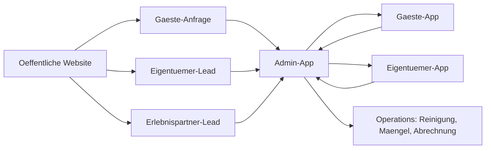
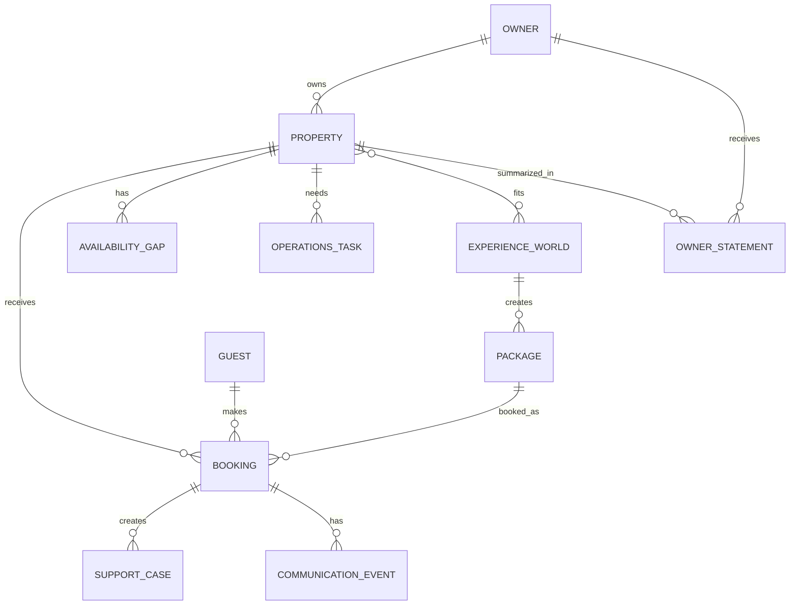

# Morrow Plattformarchitektur

Stand: 2026-06-26

Dieses Dokument beschreibt die Zielarchitektur der Morrow-Plattform, bevor weitere groessere Features gebaut werden. Es ergaenzt `docs/MORROW_MASTER_FRAME.md`, `docs/STRATEGIC_FOUNDATION_MORROW.md` und `docs/PLATFORM_MODEL_PHASE2.md`.

## Architekturentscheidung 2026-06-24

Das aktuelle Vite/React-Projekt ist ab jetzt Prototyp und Funktionsbasis, aber nicht mehr die finale Produktionsarchitektur fuer die oeffentliche Website.

Grund:

- Die aktuelle Website wird clientseitig gerendert.
- Dadurch entsteht zu wenig crawlbares HTML fuer Google, SEO, GEO und organisches Wachstum.
- Morrow braucht fuer Startseite, Auszeiten, Eigentuemerpfad und Ratgeber echtes server- oder statisch gerendertes HTML.

Neue technische Richtung:

```text
Next.js / React Monorepo + Supabase

apps/web       oeffentliche SEO-Website
apps/guest     Gaeste-App / Deine Auszeit
apps/owner     Eigentuemer-App
apps/admin     Admin-App
packages/ui
packages/domain
packages/supabase
```

Prioritaet:

1. Vite-Prototyp einfrieren und nur kritische Fixes umsetzen.
2. Neues Plattform-Fundament als Monorepo aufsetzen.
3. Zuerst die oeffentliche Website migrieren: Startseite, Auszeiten, Eigentuemerseite, Ratgeber, SEO, Sitemap, `robots.txt`, Schema.org.
4. Danach Gaeste-App, Admin-App und Eigentuemer-App schrittweise migrieren.
5. Eigentuemer-App vertiefen, sobald Admin-, Objekt- und Buchungsdaten stabil genug sind.

Arbeitsregel:

- Neue Features werden nur dann noch im Vite-Prototyp gebaut, wenn sie MVP-kritisch sind oder als Funktionsvorlage fuer die Migration dienen.
- Oeffentliche Website-Entscheidungen muessen ab jetzt SEO-/SSR-/SSG-faehig gedacht werden.
- Admin bleibt Quelle der Wahrheit; Web, Guest und Owner lesen gezielte Ausschnitte aus Supabase/domain-Modellen.

Umsetzungsstand 2026-06-26:

- Das npm-Workspace-Monorepo ist angelegt.
- `apps/web` ist als erste Next.js-App aktiv und erzeugt statische Seiten inklusive `sitemap.xml` und `robots.txt`.
- `apps/admin` ist als Next-App aktiv und uebernimmt erste operative Admin-Funktionen direkt aus Supabase.
- `apps/owner` ist als geschuetzte MVP-Light Eigentuemer-App gestartet.
- `apps/guest` ist als Next-App gestartet und bildet den ersten codegeschuetzten Gaestebereich fuer Buchung, Auszeit, Vor-Ort-Hinweise, Hilfe und Feedback ab.
- `packages/ui`, `packages/domain` und `packages/supabase` existieren als erste Shared-Packages.
- Der bisherige Vite-Code bleibt unveraendert als Prototyp im Root und wird ueber `prototype:*` Scripts betrieben.
- Die naechste produktive Arbeit ist die Vertiefung der Guest-App-Migration aus dem Vite-Prototyp, besonders Karte, Wetter, Gezeiten, Veranstaltungen, Support-Chat und Feedback-/Wiederbuchungslogik.
- Der Eigentuemerbereich zeigt im Next-Fundament erste Objekt-, Buchungs-, Lueckenmarketing-, Operations- und Abrechnungsinformationen als begrenzten Ausschnitt aus Admin-/Supabase-Daten.
- Eigentümerdokumente sind als eigene `owner_documents`-Datenquelle angelegt: Admin pflegt Vereinbarungen, Abrechnungen, Belege, Reports und Übergaben pro Unterkunft; die Owner-App zeigt nur sichtbare Dokumente zu freigeschalteten Objekten.
- Eigentümer können aus der Owner-App strukturierte Rückfragen senden; Eigenbelegung/Verfügbarkeit wird bereits mit Von-/Bis-Daten an Admin übergeben, bleibt im MVP aber bewusst eine zu prüfende Anfrage statt automatischer Kalenderänderung. Die letzten Rückfragen werden über `get_owner_dashboard().messages` im Eigentümerbereich wieder sichtbar gemacht.

## Grundentscheidung

Morrow besteht nicht aus einer einzigen Website mit ein paar Unterseiten.

Morrow besteht aus:

1. einer oeffentlichen Website
2. einer Gaeste-App
3. einer Eigentuemer-App
4. einer Admin-App

Die oeffentliche Website erzeugt Nachfrage, Vertrauen und Leads. Die drei App-Welten bilden die operative Plattform.

Kurzform:

- Website: entdecken, verstehen, anfragen
- Gaeste-App: Aufenthalt begleiten
- Eigentuemer-App: Ertrag, Objekt und Transparenz zeigen
- Admin-App: Morrow operativ steuern

## Warum Nicht Nur Drei Bereiche?

Die Einteilung `Eigentuemer`, `Gaeste`, `Admin` ist fuer die Produktlogik richtig.

Architektonisch braucht Morrow zusaetzlich eine oeffentliche Website-Schicht, weil nicht jeder Besucher bereits in einer App ist. Die Website ist der Eingang fuer Gaeste, Eigentuemer, Erlebnispartner, SEO/GEO, Ads und Vertrauen.

Deshalb gilt:

**Drei Apps plus oeffentliche Website.**

## Plattformkarte



## App-Welten

### 1. Oeffentliche Website

Zweck:

- Morrow positionieren
- Gaeste fuer kuratierte Auszeiten gewinnen
- Eigentuemer fuer Ertragspotenzial und modernes Vermietungsmodell gewinnen
- Erlebnispartner und lokale Anbieter einsammeln
- Ratgeber-/SEO-/GEO-Traffic aufnehmen
- Vertrauen in Marke, Ort und Modell schaffen

Typische Routen:

- `/`
- `/auszeiten` oder bestehend `/pakete`
- `/pakete/family-escape`
- `/pakete/couple-reset`
- `/ratgeber`
- `/ratgeber/[artikel]`
- `/eigentuemer`
- `/partner/erlebnisanbieter`
- `/impressum`
- `/datenschutz`

Wichtig:

- Kein Dashboard-Gefuehl.
- Keine interne Sprache wie MVP, Admin, Pipeline oder Provision im Gaeste-Flow.
- Gaeste- und Eigentuemerpfad muessen sichtbar getrennt sein.
- Die Website darf Leads erzeugen, aber sie ist nicht der Ort fuer operative Steuerung.

### 2. Gaeste-App

Zweck:

- gebuchte oder angefragte Auszeiten begleiten
- Unterkunft, Erlebnis, Check-in, Empfehlungen und Hilfe anzeigen
- Gaeste vor, waehrend und nach dem Aufenthalt fuehren
- Support und Feedback einsammeln

Bestehender Einstieg:

- `/deine-auszeit/[bookingOrLeadId]?code=...`

Langfristiger App-Name:

- `Deine Auszeit`

Kernmodule:

- Start / Ueberblick
- Meine Buchung
- Unterkunft und Check-in
- Erlebnis / Tagesplan
- Vor Ort / Karte / Empfehlungen
- Hilfe / Support
- Feedback nach Aufenthalt
- Wiederkommen / naechste Auszeit

Prinzipien:

- Zugang erst nach Anfrage, Reservierung oder Buchung.
- Kein generisches Nutzerkonto als Marketing-CTA.
- App-artiges Gefuehl, aber browserbasiert.
- Alle Informationen muessen aus Admin-/Buchungsdaten ableitbar sein.
- Supportmeldungen fliessen zur Admin-App zurueck.

Nicht Zweck der Gaeste-App:

- Eigentuemerinformationen anzeigen
- interne Margen, Provisionen oder Operationsdaten zeigen
- vollstaendige freie Suche wie Airbnb bauen

### 3. Eigentuemer-App

Zweck:

- Eigentuemern Transparenz und Kontrolle geben
- Morrow als modernes Ertrags- und Vermietungssystem beweisen
- Objekte, Buchungen, Luecken, Vermarktung, Operations und Abrechnung sichtbar machen

Moeglicher Einstieg:

- Phase 1: oeffentliche Landingpage `/eigentuemer` plus Leadformular
- Phase 1/2: geschuetzter Bereich als eigene App, ueber `/owner` oder `/app/eigentuemer` von der Website weitergeleitet

Empfohlene langfristige Route:

- Oeffentliche Landingpage: `/eigentuemer`
- Geschuetzter Bereich: `/owner`
- Alternativer sprechender Einstieg: `/app/eigentuemer`

Kernmodule:

- Dashboard
- Meine Objekte
- Buchungen
- Belegung / freie Luecken
- Eigenbelegung
- Vermarktung / Kampagnen / Erlebniswelten
- Reinigung / Maengel / Objektstatus
- Abrechnungen / Auszahlungen
- Dokumente / Vereinbarungen
- Nachrichten / Freigaben

MVP-Light-Variante:

- Objektuebersicht
- Buchungsuebersicht
- freie Zeitraeume
- einfache Netto-/Umsatzanzeige
- sichtbare aktive Morrow-Massnahmen
- Monatsabrechnung als Status oder PDF-Link

Prinzipien:

- Der Bereich darf nicht wie kaltes SaaS wirken.
- Zielgefuehl: professionelle Betreuung, Transparenz, Entlastung.
- Eigentuemer sollen nicht alles selbst erledigen muessen.
- Die App zeigt, was Morrow tut und welchen Effekt es hat.
- Der geschuetzte Zugriff wird ueber freigeschaltete Eigentuemerprofile gesteuert.
- Ein Eigentuemer sieht nur Objekte, Auszeiten, Buchungen und Abrechnungsinformationen, die ueber Objekt-Rechte mit seinem Profil verbunden sind.
- Admin bleibt die Quelle der Wahrheit; die Eigentuemer-App ist ein kuratierter, begrenzter Ausschnitt daraus.

Nicht Zweck der Eigentuemer-App:

- interne Adminarbeit ersetzen
- komplexe Property-Management-Software nachbauen
- Eigentuemer mit Rohdaten ueberfordern

### 4. Admin-App

Zweck:

- internes Betriebssystem fuer Morrow
- Leads, Gaeste, Buchungen, Objekte, Eigentuemer, Erlebniswelten, Operations und Abrechnung steuern

Bestehender Einstieg:

- `/admin`

Kernmodule:

- Uebersicht / Tagessteuerung
- Leads
- Aufgaben
- Gaeste / Kunden
- Buchungen
- Auszeiten / Erlebniswelten
- Objekte
- Eigentuemer
- Agenturen
- Erlebnisanbieter
- lokale Orte / Empfehlungen
- Supportfaelle
- Reinigung
- Maengel / Handwerker
- Abrechnungen
- Kommunikation
- Reporting
- Rollen / Berechtigungen

Prinzipien:

- Admin ist die fuehrende operative Steuerung.
- Alle externen Apps lesen aus oder schreiben in Strukturen, die Admin pruefen kann.
- Jede wichtige Aktion braucht Status, Verantwortlichkeit und spaeter Auditierbarkeit.
- Admin darf dichter, funktionaler und weniger emotional sein als Website und Apps.

Nicht Zweck der Admin-App:

- oeffentliche Markenkommunikation
- Eigentuemer mit internen Details belasten
- Gaesteerlebnis direkt im Admin gestalten, ohne Vorschau-/Freigabelogik

## Daten-Domaenen

Die Plattform sollte entlang klarer Domaenen wachsen.

### Identity Und Rollen

- Admin-User
- Morrow-Mitarbeitende
- Gaestezugang ueber Buchung/Code
- spaeter Eigentuemer-User
- spaeter Erlebnispartner-User

Grundsatz:

- Admin-Zugang ist rollenbasiert.
- Gaestezugang darf leicht bleiben.
- Eigentuemerzugang braucht hohes Vertrauen und klare Rechte je Objekt.

### Leads Und CRM

- Gaeste-Leads
- Eigentuemer-Leads
- Erlebnispartner-Leads
- Status
- Quelle / Kampagne / UTM
- Notizen
- Wiedervorlagen
- Kommunikationshistorie

Fuehrende App:

- Admin-App

### Objekte

- Objektprofil
- Adresse / Lage
- Ausstattung
- Schlafplaetze
- Bilder / Rechte
- Eigentuemer
- Agentur / Verwaltung
- operative Zustandsdaten
- strukturierte Attribute fuer Erlebniswelten

Fuehrende App:

- Admin-App

Sichtbar in:

- Website, wenn veroeffentlicht
- Gaeste-App, wenn Teil einer Buchung
- Eigentuemer-App, wenn Eigentuemerverknuepfung besteht

### Auszeiten Und Erlebniswelten

- Auszeit
- Zielgruppe
- Anlass
- Objektzuordnung
- Erlebnisbausteine
- lokale Empfehlungen
- Termine / Preise
- Status
- SEO-/Landingpage-Daten

Fuehrende App:

- Admin-App

Sichtbar in:

- Website
- Gaeste-App
- Eigentuemer-App als Vermarktungs-/Kampagnenlogik

### Buchungen

- Anfrage
- Reservierung
- Zahlung
- Aufenthaltsstatus
- Gaeste
- Objekt
- Auszeit / Erlebniswelt
- Aufgaben
- Kommunikation
- Feedback

Fuehrende App:

- Admin-App

Sichtbar in:

- Gaeste-App
- Eigentuemer-App, gefiltert und verdichtet

### Operations

- Reinigung
- Checklisten
- Maengel
- Handwerker
- Foto-Upload
- Freigaben
- Support

Fuehrende App:

- Admin-App

Sichtbar in:

- Gaeste-App nur als Hilfe-/Statusausschnitt
- Eigentuemer-App als Objektstatus und Transparenz

### Finanzen Und Ertrag

- Umsatz
- Kosten
- Provision
- Nettoauszahlung
- Abrechnung
- Belege
- Vergleichswerte
- Luecken- und Ertragspotenzial

Fuehrende App:

- Admin-App

Sichtbar in:

- Eigentuemer-App

Nicht sichtbar in:

- Gaeste-App

## Zentrale Beziehungen



## Routing-Empfehlung

Kurzfristig bestehende Routen respektieren:

- Website bleibt unter `/`
- Gaeste-App bleibt unter `/deine-auszeit/[id]`
- Admin bleibt unter `/admin`
- Eigentuemer-Landingpage bleibt unter `/eigentuemer`

Langfristige Struktur:

- `/` oeffentliche Website
- `/deine-auszeit/[id]` Gaeste-App, solange Zugang codebasiert ist
- `/app/eigentuemer` Eigentuemer-App
- `/admin` Admin-App
- `/partner/erlebnisanbieter` bleibt oeffentliche Partner-Landingpage
- spaeter optional `/app/partner` fuer Erlebnispartner, wenn Partnerlogin wirklich gebraucht wird

Warum `/app/eigentuemer`:

- trennt oeffentliche Eigentuemer-Landingpage von geschuetztem Arbeitsbereich
- laesst spaeter weitere App-Bereiche zu
- vermeidet Verwechslung zwischen Akquise und Login

## UI- Und Shell-Grenzen

Jede Welt braucht eine eigene Shell.

### Website-Shell

- Marken-Navigation
- Website-Footer mit Impressum, Datenschutz, AGB, Buchungsbedingungen, Stornobedingungen und Zahlungsbedingungen
- SEO-faehige Seiten
- klare CTAs

### Gaeste-App-Shell

- kein normaler Website-Footer
- kompakte App-Navigation
- persoenlicher Buchungskontext
- mobile-first

### Eigentuemer-App-Shell

- ruhiges Dashboard
- Objekt- und Zeitraumkontext
- Kennzahlen und Status
- klare Freigaben und Nachrichten

### Admin-App-Shell

- dichte Arbeitsnavigation
- Tabellen, Filter, Drawer, Statusaktionen
- Aufgaben- und Tageslogik
- Rollen-/Rechtefaehigkeit

## MVP-Reihenfolge

### Schritt 1: Architektur Festhalten

- dieses Dokument als Referenz nutzen
- Master Frame verlinken
- bestehende Route- und App-Welten nicht vermischen

### Schritt 2: Website Scharfstellen

- Startseite Gaeste- und Eigentuemerpfad klarer trennen
- Eigentuemer-CTA auf Ertragspotenzial ausrichten
- Erlebniswelten als Reiseanlaesse sichtbar machen

### Schritt 3: Datenbasis Fuer Objekte Und Attribute

- Objektattribute strukturieren
- Erlebniswelten modellieren
- Objekte Erlebniswelten zuordnen

### Schritt 4: Admin Als Fuehrende Steuerung Ausbauen

- Objektverwaltung
- Eigentuemerprofile
- Buchungen
- Lueckenmarketing
- Operations
- Abrechnung light

### Schritt 5: Eigentuemer-App Light

- erst zeigen, was in Admin stabil gepflegt werden kann
- keine leere Dashboard-Huelle bauen
- Fokus auf Objekte, Buchungen, Luecken, Massnahmen, Auszahlung
- Dokumente und spätere Abrechnungen aus normalisierten Admin-Datensätzen lesen, nicht aus verstreuten Objekt-Payloads

### Schritt 6: Gaeste-App Weiter Veredeln

- aus echten Buchungsdaten speisen
- Support und Feedback konsistent zur Admin-App fuehren
- Empfehlungen und lokale Karte weiter kuratieren

## Architektur-Leitplanken

- Keine neue App-Welt bauen, wenn die Daten nicht im Admin gepflegt werden koennen.
- Keine oeffentliche Seite mit internen Admin-Konzepten vermischen.
- Keine Eigentuemer-Funktion bauen, die nicht auf Ertrag, Transparenz oder Entlastung einzahlt.
- Keine Gaeste-Funktion bauen, die nur nett ist, aber Aufenthalt, Buchung, Support oder Wiederkehr nicht verbessert.
- Ein Objekt muss mehrere Reiseprodukte und Erlebniswelten tragen koennen.
- Ein Statuswechsel muss spaeter Aufgaben, Kommunikation und Sichtbarkeit beeinflussen koennen.
- Admin ist die Quelle der Wahrheit; Website, Gaeste-App und Eigentuemer-App sind gezielte Ausschnitte.

## Offene Architekturentscheidungen

Diese Punkte muessen vor groesserem Ausbau entschieden oder zumindest bewusst vertagt werden:

- Wann wird aus codebasiertem Gaestezugang ein echter Account?
- Wird langfristig `/owner` als kurzer geschuetzter Einstieg beibehalten oder wird `/app/eigentuemer` die sichtbare Hauptadresse?
- Werden Erlebnispartner langfristig eine eigene App bekommen oder im Admin/Kommunikationsfluss bleiben?
- Wie granular werden Admin-Rollen: Operations, Guest Support, Finance, Marketing, Owner Management?
- Wird Abrechnung als interne Admin-Funktion mit PDF-Ausgabe gestartet oder direkt als Eigentuemer-App-Modul?
- Wie werden externe Agenturen in der Uebergangsphase technisch modelliert?

## Kurzentscheidung

Die Plattform wird als **Website plus drei Apps** gedacht:

- Website fuer Nachfrage und Vertrauen
- Gaeste-App fuer Aufenthalt und Service
- Eigentuemer-App fuer Transparenz und Ertrag
- Admin-App fuer Steuerung und Operations

Diese Struktur ist die Grundlage fuer alle weiteren Plattformentscheidungen.
